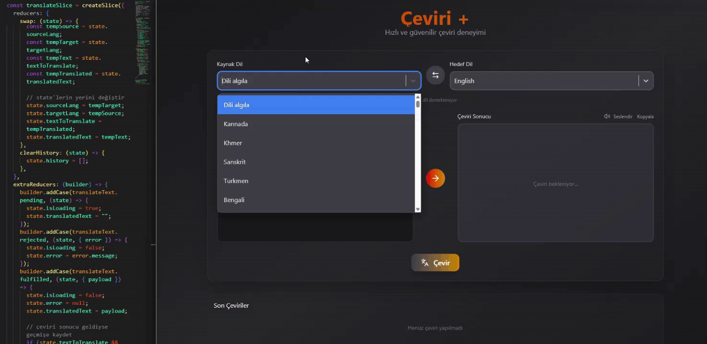

<h1>Çeviri +</h1>

    React 19 ve Redux Toolkit kullanılarak geliştirilmiş, 130'dan fazla dili destekleyen modern ve yüksek performanslı bir çeviri uygulamasıdır.

    

    It is a modern, high-performance translation application developed using React 19 and Redux Toolkit, supporting over 130 languages.

<h2>Kullanılan Teknolojiler</h2>
<ul>
    <li>Framework: React 19 (Vite)</li>
    <li>State Yönetimi: Redux Toolkit</li>
    <li>Tasarım: Tailwind CSS 4, React Select</li>
    <li>API İletişimi: Axios</li>
    <li>İkonlar: Lucide-React</li>
</ul>

<h2>Technologies Used</h2>
<ul>
    <li>Framework: React 19 (Vite)</li> 
    <li>State Management: Redux Toolkit</li> 
    <li>Design: Tailwind CSS 4, React Select</li> 
    <li>API Communication: Axios</li> 
    <li>Icons: Lucide-React</li>
</ul>
